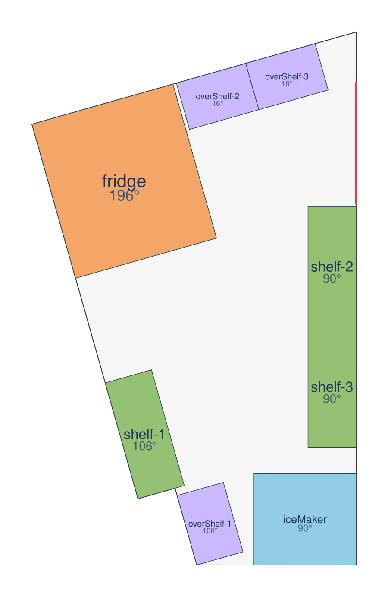
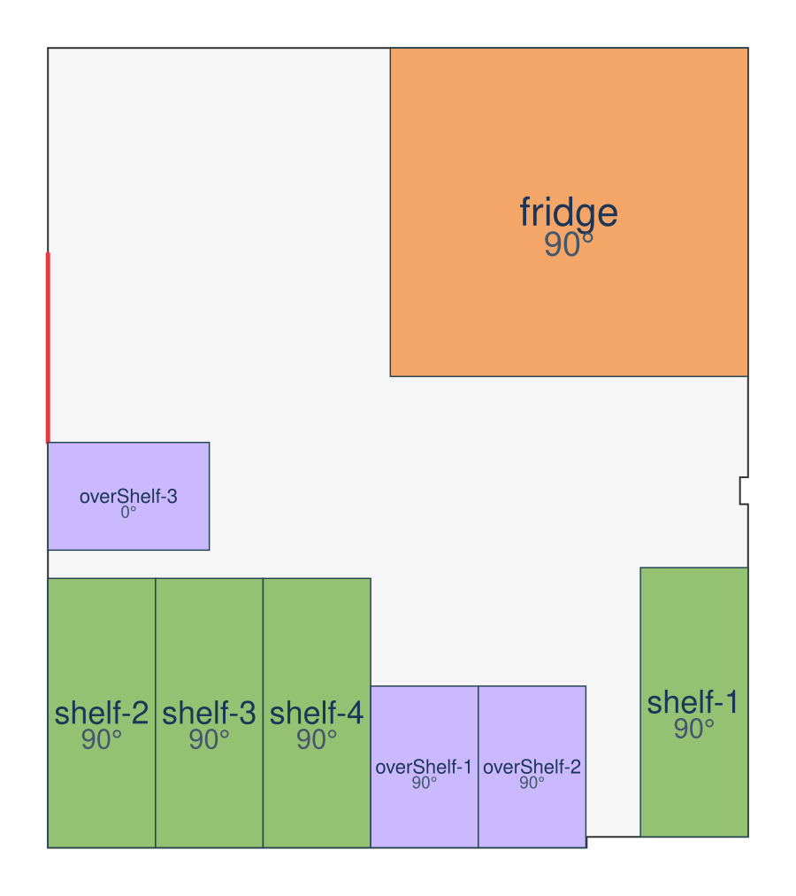
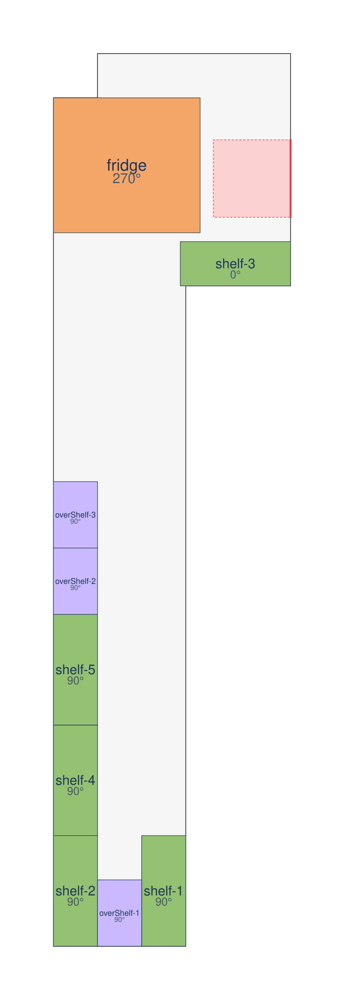
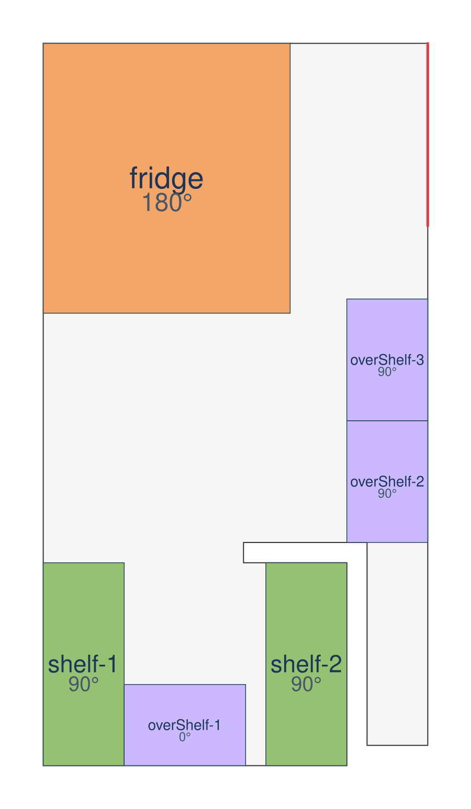
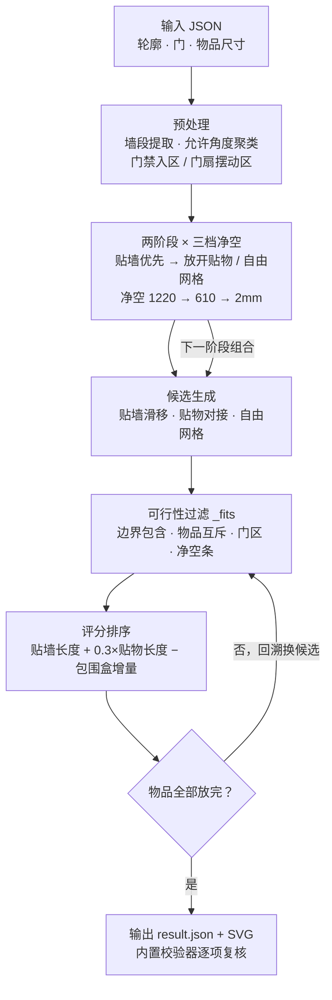

<div align="center">

# Room Layout Solver

**多边形房间内的矩形家具自动布局求解器**

贴墙优先 · 门净空感知 · 确定性输出 · 零第三方依赖

[](https://github.com/zeng-bohan/room-layout-solver/actions/workflows/ci.yml)
[](https://www.python.org)
[](https://github.com/astral-sh/ruff)
[](LICENSE)

</div>

在给定的多边形房间轮廓内自动摆放若干矩形物品（冰箱 / 货架 / 离地架 / 制冰机）：
不与边界及其他物品重叠、不遮挡门、物品方向与墙平行或垂直、**优先全部贴墙放置**，
并满足冰箱开门边净空等业务约束。输出可行性与每件物品的中心点坐标、旋转角度。

## 目录

- [1. AI 工具使用说明](#1-ai-工具使用说明)
- [2. 结果速览](#2-结果速览)
- [3. 约束建模](#3-约束建模)
- [4. 算法设计](#4-算法设计)
- [5. 快速开始](#5-快速开始)
- [6. 输入与输出格式](#6-输入与输出格式)
- [7. 输出示例](#7-输出示例)
- [8. 测试与质量保障](#8-测试与质量保障)
- [9. 设计取舍与边界说明](#9-设计取舍与边界说明)
- [10. 仓库结构](#10-仓库结构)

## 1. AI 工具使用说明

- **使用的工具**：ZCode（GLM-5.3-Flash 模型）。
- **AI 主要帮助的部分**：整体思路拆解（约束建模、两阶段搜索策略）、代码骨架与几何
  工具函数生成、SVG 可视化与冒烟测试用例的生成、Debug 定位。
- **我自己理解并调整的关键逻辑**：
  1. **贴墙矩形与边界共线的判定**：贴墙摆放时矩形边与轮廓边完全重合，相交检测必须把
     "共线"与"真穿越"区分开，否则所有贴墙解都会被误杀（`geometry.segments_properly_cross`）。
  2. **"贴墙优先"的两阶段搜索**：第一阶段候选只允许贴墙；失败才放开到"贴已有物品"
     和自由网格。这直接对应题面"空间充足时优先所有物品均贴墙"的软性要求。
  3. **冰箱开门净空的三档回退**：开门边不能放东西 → 先尝试整门扇摆动深度（1220），
     再半扇（610），最后退到"仅不允许贴触"（2mm），并如实报告所用档位。
  4. **旋转角的 mod 360 / mod 180 陷阱**：矩形的占位在 mod 180 下对称，但冰箱开门边
     方向在 90° 与 270° 下不同，输出吸附角度时必须按 mod 360 处理，否则门边朝向会反。
  5. **内开门净空**：按题面主述取门宽 N 的 N×N 方形作为门扇摆动区（`isOpenInward=true`
     时生成，物品不得侵入）。
  6. **求解预算的确定性**：搜索若按时钟截断，输出会随机器快慢漂移（实测慢机器上会在
     中途放弃第一阶段、错过全净空解）。改为纯节点数预算后同输入输出恒定；候选改为
     "先可行性过滤、后评分排序"，提速 5 倍且结果逐字节不变（见[设计文档](docs/design.md)）。

## 2. 结果速览

题目给定的 4 个示例全部可行，且全部在"所有物品贴墙"的最优先阶段求解成功，
并通过内置校验器与独立交叉校验的双重验证：

| 示例 | 房间特点 | 物品数 | 全部贴墙 | 冰箱开门净空 | 参考耗时* |
| --- | --- | --- | :---: | --- | --- |
| example1 | 斜墙五边形（15.85° 朝向族），含制冰机 | 8 | ✅ | 1220 mm（整门扇） | ~14 s |
| example2 | 矩形大空间 | 8 | ✅ | 1220 mm（整门扇） | ~5 s |
| example3 | 内开门（N×N 摆动区） | 9 | ✅ | 610 mm（半门扇） | ~1 s |
| example4 | 带凹槽轮廓 | 6 | ✅ | 610 mm（半门扇） | <1 s |

\* 参考：Python 3.12 / 笔记本 CPU。搜索预算按节点数计，**同输入恒定同输出**，与机器快慢无关。

| example1（斜墙五边形） | example2 |
| --- | --- |
|  |  |
| **example3（内开门，9 件）** | **example4（带凹槽轮廓，6 件）** |
|  |  |

布局图为等比俯视图：灰底为房间轮廓，红线为门，粉色虚线方块为内开门 N×N 摆动区，
橙/蓝/绿/紫分别为冰箱/制冰机/货架/离地架，标注物品名与旋转角。

## 3. 约束建模

| 题面要求 | 建模方式 |
| --- | --- |
| 物品在轮廓内，不重叠 | 收缩 0.5mm 后做"点在多边形内 + 边无真穿越"判定；矩形间 OBB SAT 严格重叠检测（允许贴触） |
| 与轮廓边平行或垂直 | 从边界边方向聚类得到允许角度集 θ（含斜墙，如 example1 的 15.85°/105.85° 族），物品旋转角 ∈ ⋃{θ, θ+90} |
| 优先贴墙 | 两阶段搜索（见下）；候选评分：贴墙长度 > 贴物长度 > 占地包围盒增量 |
| 不遮挡门 | 门沿线生成薄条禁入区；`isOpenInward=true` 时另生成 N×N 门扇摆动区 |
| 冰箱开门边不能放东西 | 冰箱 length 边取局部 +y 侧为开门边；其外侧净空条（三档深度）内不得有任何物品，且净空条必须落在房间内（门边不许贴墙） |
| 输出 | `feasible` + 每件物品中心点（原始坐标系）与旋转角（初始 0°，逆时针，度） |

## 4. 算法设计



求解流程（`Solver.solve`）：

1. **预处理**：轮廓平移到原点；提取墙段（方向单位向量、内法线）；门吸附到所在墙；
   生成门禁入区 / 内开门 N×N 摆动区；从墙方向聚类出允许角度集。
2. **物品排序**：冰箱最优先（约束最强），其余按面积降序。
3. **两阶段 × 三档净空**：外层 `贴墙限定 ∈ {开, 关}`，内层冰箱净空 ∈ {门扇深, 半扇, 2mm}
   （无冰箱则单档）；任一组合搜索成功即返回，并报告所用阶段与档位。
4. **候选生成**（每个搜索节点）：
   - 贴墙：沿每面墙以 50mm 步幅滑动（两种朝向），含贴墙末端精确位；
   - 贴物（仅第二阶段）：沿已放物品四边以 50mm 步幅对接，形成成排布局；
   - 自由网格（仅第二阶段）：250mm 网格兜底，评分最低，仅作最后手段。
5. **回溯搜索（DFS）**：候选先过 `_fits` 可行性过滤（边界包含、物品互斥、门区、
   冰箱净空条），再按评分排序逐个试放；剩余面积剪枝；节点预算兜底（150k 节点）。
6. **输出还原**：坐标加回原偏移，角度 mod 360 吸附（轴对齐吸附到 0/90/180/270），
   批量写入 JSON 与 SVG。

更深入的几何判定细节、确定性论证与性能实测见 [docs/design.md](docs/design.md)。

## 5. 快速开始

环境：**Python 3.8+，零第三方依赖**（纯标准库）。Windows / Linux / macOS 均可。

```bash
# 求解单个或多个输入（目录会自动扫描 *.json）
python main.py examples/example1.json --out outputs
python main.py examples --out outputs

# 可选：安装为命令行工具（需要 pip）
pip install -e .
room-layout-solver examples --out outputs

# 冒烟测试（可行 / 不可行 / 门区阻塞 / 净空回退 四类用例）
python tests.py

# 独立交叉校验：用与主实现零共享代码的方式复核 outputs/ 里的全部结果
python scripts/independent_check.py
```

每次求解输出 `<name>.result.json`（结果），可行时额外输出 `<name>.svg`（俯视图），
并在终端打印独立校验器的逐项检查结果（校验失败进程退出码为 1）。

## 6. 输入与输出格式

### 输入格式（与题目给定一致）

```json
{
  "boundary": [[x, y], ...],          // 轮廓折线（首尾可闭合重复，自动去重）
  "door": [[x1, y1], [x2, y2]],       // 门两端正交坐标
  "isOpenInward": false,              // 内开门为 true：额外保留 N×N 门扇区
  "algoToPlace": {"fridge": [1220, 1330], "shelf-1": [1000, 400]}
}
```

### 输出格式

```json
{
  "feasible": true,
  "allItemsWallFlush": true,            // 是否在"全部贴墙"阶段求解成功
  "fridgeDoorClearanceMm": 610.0,       // 冰箱开门边实际保留的净空深度
  "placements": {
    "fridge": {"center": [5191.89, 31931.02], "rotation": 195.85}
  }
}
```

不可行时返回 `{"feasible": false, "placements": {}, "fridgeDoorClearanceMm": null}`。

## 7. 输出示例

example1 输出节选（完整见 [outputs/example1.result.json](outputs/example1.result.json)）：

```json
{
  "feasible": true,
  "allItemsWallFlush": true,
  "fridgeDoorClearanceMm": 1220.0,
  "placements": {
    "fridge":     {"center": [5191.8913, 31931.0171], "rotation": 195.851998},
    "iceMaker":   {"center": [6696.7357, 29121.7939], "rotation": 90.0},
    "shelf-1":    {"center": [6921.7357, 31220.2897], "rotation": 90.0},
    "overShelf-3":{"center": [6546.3095, 32798.9897], "rotation": 15.852}
  }
}
```

全部结果文件：[example1](outputs/example1.result.json) ·
[example2](outputs/example2.result.json) ·
[example3](outputs/example3.result.json) ·
[example4](outputs/example4.result.json)。

## 8. 测试与质量保障

四层验证，全部接入 CI（Python 3.8 / 3.12 双版本矩阵）：

| 层 | 内容 | 运行方式 |
| --- | --- | --- |
| 冒烟测试 | 可行 / 不可行 / 门区阻塞 / 冰箱净空回退 四类端到端用例 | `python tests.py` |
| 内置校验器 | 对输出重新推导全部约束，逐条 PASS/FAIL，失败退出码 1 | 每次求解自动执行 |
| 独立交叉校验 | 与主实现**零共享代码**（射线法 PIP + 取样 + 叉积混判），捕获"实现与校验器共用同一套错误假设"的系统性风险 | `python scripts/independent_check.py` |
| 静态检查 | ruff lint + format，CI 强制 | `ruff check . && ruff format --check .` |

确定性说明：搜索预算只按 DFS 节点数计（150k），不含墙钟判断——同一输入在任何
机器上得到逐字节相同的输出（4 次重复运行验证），README 中的布局图永远可以复现。

## 9. 设计取舍与边界说明

- **内开门净空取 N×N**（N=门宽），按题面主述；输入说明中的"1x1"理解为单位化的特例
  （N=1 时二者一致）。如需改成 1m×1m，只需调整 `Problem._build_door_zones`。
- **冰箱开门边**约定为 length 边中的局部 +y 侧，搜索会枚举 4 个朝向，等价于让算法
  自行选择哪一侧做开门边；开门边不允许贴墙（净空条必须落在房间内）。
- **贴墙**定义为物品任一边与墙线重合（±1mm）；成排摆放时相邻物品互相贴靠也计入
  紧凑度评分，但"全贴墙"阶段只接受直接贴墙的解。
- **候选步长 50mm 是启发式**而非完备枚举：步进位形可能理论上错过个别更优解，但
  每面墙都补了贴墙末端精确位，且三种候选来源互补，4 个示例均得到全贴墙解。
  完备性 traded for 速度的讨论见[设计文档](docs/design.md#11-性能实测)。
- 搜索预算 150k 节点，极端输入下达上限会如实返回 `feasible: false`
  （本仓库 4 个示例远未触及上限，总耗时约 20s）。
- 允许的角度来自轮廓边方向聚类（0.5° 容差，接近 0/90° 时精确吸附），斜墙房间
  （example1）自动引入 15.85°/105.85° 朝向族，与题面"平行或垂直"一致。

## 10. 仓库结构

```
├── main.py                     # CLI 入口：python main.py examples --out outputs
├── tests.py                    # 冒烟测试：python tests.py
├── layout_solver/              # 核心包
│   ├── geometry.py             #   纯几何原语：PIP（even-odd）、线段真穿越、OBB SAT
│   ├── solver.py               #   Problem 建模 + 两阶段回溯搜索
│   ├── validate.py             #   独立校验器
│   └── visualize.py            #   零依赖 SVG 俯视图渲染
├── scripts/
│   └── independent_check.py    # 独立交叉校验（与主实现零共享代码）
├── examples/                   # 题目给定的 4 个输入
├── outputs/                    # 运行产物（结果 JSON + SVG 俯视图）
├── docs/
│   ├── design.md               # 设计文档：几何细节 / 搜索策略 / 确定性论证 / 性能
│   └── 题目要求.txt             # 原题面
├── pyproject.toml              # 项目元数据 + ruff 配置
├── .github/workflows/ci.yml    # CI：ruff + 冒烟测试 + 全示例求解 + 独立校验
├── CHANGELOG.md                # 更新日志
└── LICENSE                     # MIT
```

## License

MIT — see [LICENSE](LICENSE).
